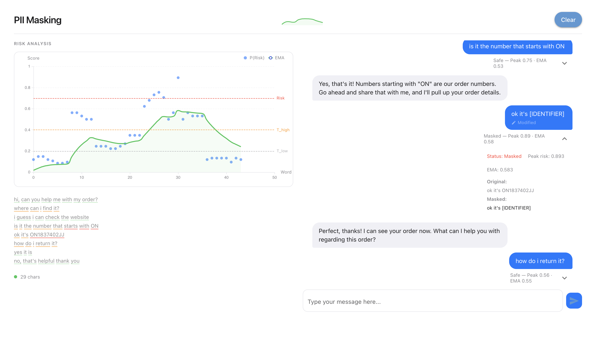

# CC++ PII Masking

A CC++-inspired streaming exchange classifier for PII detection and masking in black-box hosted LLMs.



## Quick Start

```bash
git clone https://github.com/davisgcii/ccpp.git
cd ccpp
./setup.sh                                # installs deps, prompts for API key
uv run python scripts/nicegui_client.py   # launches GUI at http://127.0.0.1:8080
```

The default backend is **MLX** (Apple Silicon). Base models are downloaded automatically from HuggingFace on first run. Pre-trained LoRA adapters are included in the repo.

## Using the GUI

The GUI is a two-panel chat interface built with NiceGUI. Type messages in the input box and press Enter (or click Send) to submit.

**Left panel — Risk Analysis:**
- **ECharts risk chart** updates live as you type, showing per-word P(FAIL) scatter dots and a smoothed EMA line with threshold markers
- **Utterance log** persists across messages with colored underlines (green/orange/red) showing risk per word
- Chart is continuous across the conversation — word indices don't reset between messages
- Hover over any dot to see the P(Risk) score, EMA value, and the exact text that was classified

**Right panel — Conversation:**
- iMessage-style chat bubbles (user = blue, assistant = gray)
- If PII is detected, a **review panel** appears showing detected entities as toggleable pills — approve or reject each mask before sending
- Masked messages show a "Modified" badge; click to toggle between original and masked text
- Assistant responses render markdown

The assistant responds via the Anthropic API (requires `ANTHROPIC_API_KEY` in `.env`).


## How It Works

Two-stage cascade running on streaming text:

1. **Stage 1 (Router)** - Fast SAFE/FAIL classification using Qwen3-0.6B via MLX sequence log-likelihood (~1-2s per classification)
2. **Stage 2 (Redactor)** - Entity extraction using Qwen3-1.7B, invoked only at stream breaks when risk is detected
3. **Fast heuristics** - Regex patterns (email, phone, SSN, API keys) run before Stage 1 for instant detection

Masking triggers on any of: individual risk score >= 0.7, EMA >= 0.4, or strong heuristic match.

## Architecture

```
          Streaming text
               │
               ▼
        ┌──────────────┐
        │HoldbackBuffer│
        └──────┬───────┘
               │
     ┌─────────┴───────────┐
     │  Continuous         │  On stream break (2s pause)
     │  (during typing)    │  ─────────────────────────
     │                     │
     ▼                     │
  Fast Heuristics          │
  (regex: email,           │
   phone, SSN, …)          │
     │                     │
     ▼                     │
  Stage 1 Router           │
  Qwen3-0.6B               │
  → P(FAIL) score          │
     │                     │
     ▼                     │
  EMA Smoothing            │
  (β=0.85, hysteresis)     │
     │                     │
     └─────────┬───────────┘
               │
               ▼
       ┌───────────────┐
       │  Mask? Any:   │
       │  • risk ≥ 0.7 │
       │  • ema  ≥ 0.4 │
       │  • heuristic  │
       └──┬─────────┬──┘
       no │         │ yes
          │         │
          ▼         ▼
       Emit    Stage 2 Redactor
       as-is   Qwen3-1.7B
               → MASK "entity" category
                   │
                   ▼
              Apply masks
                   │
                   ▼
                 Emit
```

## Configuration

All settings live in `configs/default.yaml`. Key parameters:

| Setting                             | Default                         | Description                                        |
| ----------------------------------- | ------------------------------- | -------------------------------------------------- |
| `stage1.backend`                    | `mlx`                           | `mlx` (Apple Silicon) or `ollama` (cross-platform) |
| `stage1.model_name`                 | `mlx-community/Qwen3-0.6B-4bit` | Stage 1 model                                      |
| `stage2.model_name`                 | `Qwen/Qwen3-1.7B-MLX-8bit`      | Stage 2 model                                      |
| `streaming.stream_break_timeout_ms` | `2000`                          | Stream break timeout (ms)                          |
| `streaming.t_high` / `t_low`        | `0.4` / `0.2`                   | EMA hysteresis thresholds                          |
| `streaming.risk_threshold`          | `0.7`                           | Individual token risk threshold                    |

For **Ollama backend**: set `backend: ollama`, use `qwen3:0.6b`/`qwen3:1.7b` models, set `sequence_loglikelihood.enabled: false`. Requires Ollama running (`ollama serve`).

## PII Categories

| Category    | Examples                                       |
| ----------- | ---------------------------------------------- |
| person      | Human names                                    |
| contact     | Email, phone numbers                           |
| gov_id      | SSN, driver's license, passport, date of birth |
| identifier  | Order numbers, account IDs, tracking numbers   |
| location    | Street addresses, coordinates                  |
| financial   | Credit cards, bank accounts                    |
| credentials | Passwords, API keys, tokens                    |
| medical     | Medical record numbers, diagnoses              |

## Testing

```bash
uv run pytest                          # all unit tests (132 tests)
uv run pytest --cov=src/ccpp           # with coverage
uv run pytest -m integration           # integration tests (requires Ollama/API keys)
```

## Retraining (Optional)

Pre-trained LoRA adapters are included. To retrain from scratch:

```bash
# 1. Generate synthetic conversations (requires ANTHROPIC_API_KEY)
uv run python -m data.scripts.main all --count 1000

# 2. Convert to MLX training format
uv run python -m data.scripts.convert_to_mlx --stage 1
uv run python -m data.scripts.convert_to_mlx --stage 2

# 3. Train LoRA adapters
uv run python -m mlx_lm.lora --config configs/lora_stage1.yaml
uv run python -m mlx_lm.lora --config configs/lora_stage2.yaml
```

See `data/README.md` for data format details and `CLAUDE.md` for full training commands.

## Project Structure

```
src/ccpp/
  infer/       Stage 1 router, Stage 2 redactor, heuristics, guard
  llm/         LLM backends (MLX, Ollama, Anthropic, OpenAI)
  nicegui/     NiceGUI GUI client
  gui/         Gradio GUI client
  types.py     Core data types
  config.py    Configuration system
configs/       YAML configuration files
data/          Training data and generation scripts
models/        LoRA adapter weights
tests/         Test suite
```

## References

This project adapts the Constitutional Classifiers approach from jailbreak detection to PII masking in streaming LLM outputs.

- [Constitutional Classifiers](https://arxiv.org/abs/2501.18837) — original CC paper (arXiv)
- [Constitutional Classifiers++](https://arxiv.org/abs/2601.04603) — CC++ paper (arXiv)
- [Anthropic blog: Constitutional Classifiers](https://www.anthropic.com/research/constitutional-classifiers)
- [Anthropic blog: Next-Generation Constitutional Classifiers](https://www.anthropic.com/research/next-generation-constitutional-classifiers)

## Logs

- GUI debug log: `/tmp/gui_debug.log`
- Prompt logs: `/tmp/prompt_logs.jsonl`
